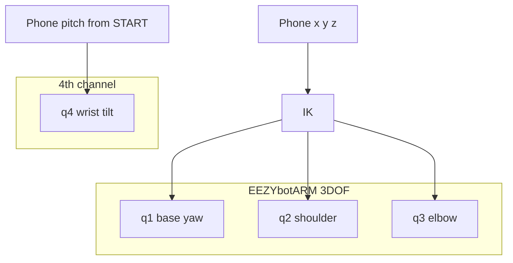
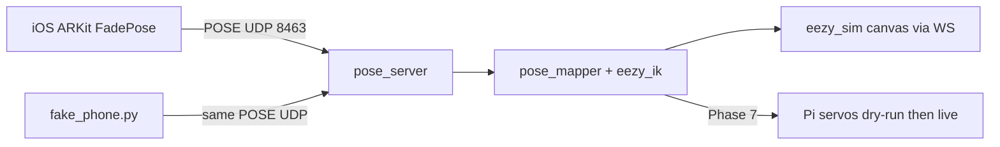

# Phone → EEZYbotARM Teleop (Step 1 TDD Plan)

Add absolute ARKit phone-pose teleop (position + tilt → IK → joints) **alongside** the existing CoreMotion rate pendant — built test-first with gated checkpoints before hardware.

There is **no CV code to remove**. README §4 vision text is roadmap prose only. The existing teach path is already the iPhone rate pendant (`phone/` → UDP `:8470` → `fade_ninja/pendant.py`).

---

## Relationship to the existing phone pendant

| Path | Location | Transport | Sensing | Control |
|------|----------|-----------|---------|---------|
| **Rate pendant (keep)** | `phone/` + `fade_ninja/pendant.py` | UDP **:8470** | CoreMotion pitch/roll only | → `JOG` rates (rail `phi/psi/theta`) |
| **Pose teleop (this plan)** | `ios/FadePose/` + `pose_server.py` | UDP **:8463** | ARKit world tracking | → IK → `q1..q4` (EEZY) |

- The CoreMotion pendant stays untouched as the **joint-space / rail fallback**.
- The ARKit app is a **second, separate** app. Do not merge them in step 1.
- Docs that say “No camera and no ARKit” are **scoped to the rate pendant**, not the whole project. Amend `phone/README.md` and `README.md` §8 accordingly when implementing Phase 0.
- ARKit app **must** declare `NSCameraUsageDescription` (camera used only for VIO; frames never sent) plus `NSLocalNetworkUsageDescription`.

---

## What the arm actually is

The physical target for **this** path is **[EEZYbotARM (Thingiverse 1015238)](https://www.thingiverse.com/thing:1015238)** by daGHIZmo — not the fade_ninja arc-rail geometry in `fade_ninja/head.py`.



| Intent | EEZYbotARM reality |
|--------|-------------------|
| Around | **q1** base yaw |
| Height + reach | **q2 + q3** coupled (parallelogram); not independent “height only” |
| Clipper tilt | Stock 3DOF has no wrist; **q4** is phone pitch in sim; real tilt servo on claw mount when wired |

**Committed control mode:** absolute phone pose → IK (not rate JOG).  
**Committed stack:** laptop/Pi runs IK at 50 Hz; minimal iOS app streams ARKit pose only; Pi can PWM servos later.

**Payload caveat:** EEZY MK1 is a desktop arm (tens of grams tip load). A hair clipper (300–500 g) will not ride it. Step 1 is sim + lightweight tip / air moves only. See Open questions.

---

## Frames and units

Define these once; every Phase 3 sign test depends on them.

| Frame | Axes | Units | Notes |
|-------|------|-------|-------|
| **ARKit** (after START) | Y-up, right-handed, **−Z forward** from the START pose | meters, quaternion | Camera used for VIO only |
| **Arm / IK** | Z-up, X forward at home yaw, Y left | **mm**, joint angles in **degrees** | Home joints named in T2.0 |

**Mapping (phone Δ → arm target Δ), applied after scale:**

```
arm_x_mm =  scale * phone_z_m * (-1000)   # ARKit −Z forward → arm +X
arm_y_mm =  scale * phone_x_m * (-1000)   # ARKit +X right  → arm −Y (or flip if build mirrors)
arm_z_mm =  scale * phone_y_m *  1000     # ARKit +Y up     → arm +Z height
```

Signs for Y may be verified once against the physical base; lock the chosen signs in `pose_mapper.py` constants and test against them.

**Orientation in step 1:** the wire carries a full quaternion. **Only pitch** (nose tilt relative to START) maps to **q4**. **Roll and yaw are parsed and discarded.**

**Default scale:** `0.3` (10 cm phone → 3 cm tip). Scale `1.0` is opt-in; EEZY horizontal reach is only ~130–180 mm.

---

## Architecture (step 1)



**Transport: UDP** (same rationale as the rate pendant): live control prefers dropping stale samples over TCP head-of-line blocking. Receiver keeps **only the newest** datagram; never queue a backlog of poses.

**Pose wire format** (ASCII, one datagram per message):

```
START <track>                              # track 0=normal required
POSE <t_ms> <x_m> <y_m> <z_m> <qw> <qx> <qy> <qz> <track>
STOP
STATUS                                     # request/response reply datagram
```

- `track`: `0` = normal, `1` = limited, `2` = relocalizing. `START` / motion only when `track == 0`.
- Camera frames are never sent.
- Port **UDP `:8463`**. Leave TCP `:8462` (virtual ESP32) and UDP `:8470` (rate pendant) alone.
- New joint names: **`q1..q4`**. Do not overload rail `phi/psi/theta` in the pose path.
- Server ACKs every datagram; the phone may ignore replies.

**Keep (parallel, not deleted):** teach/replay/profile, rail sim (`head.py`, `cutting.py`, …), `server.py`, rate pendant — the **rail + JOG** product path stays. Pose/EEZY is additive.

**IK reference:** adapt math from [meisben/easyEEZYbotARM](https://github.com/meisben/easyEEZYbotARM); implement pure functions in `fade_ninja/eezy_ik.py` with our constants (no runtime dependency on that repo).

**Servos:** stock EEZY often cites MG90S; shoulder class is **unverified**. Measure torque needs and link lengths **before Phase 7**. Do not treat MG90S × 3 as approved hardware.

---

## TDD phases (every gate has a failing test first)

### Phase 0 — Green baseline (no deletions)

1. Record baseline: `uv run pytest` (expect ~75 passed).
2. Amend pendant-scoped ARKit wording in `phone/README.md` and `README.md` §8 (pendant subsection): “No camera / no ARKit” applies to the **rate pendant**, not the project; point to this doc for the pose path.
3. Do **not** delete CV files — they do not exist. Do **not** trim README §4 vision roadmap in this phase.

**Checkpoint T0:** pytest green; README wording amended.

### Phase 1 — Pose protocol (no arm yet)

**New files:** `fade_ninja/pose_protocol.py`, `tests/test_pose_protocol.py`

| ID | Test first | Pass when |
|----|------------|-----------|
| T1.1 | parse `POSE …` | t_ms, xyz, quat, track validated |
| T1.2 | reject bad lines | wrong arity / NaN → error |
| T1.3 | `START` resets origin | subsequent poses accepted relative to origin |
| T1.4 | quaternion | \|q\| within 1e-3 of 1 or reject |
| T1.5 | tracking gate | `START` / accept motion only when `track == normal` |

**Checkpoint T1:** protocol tests green. No network yet.

### Phase 2 — EEZYbotARM FK / IK (HARD GATE)

**New files:** `fade_ninja/eezy_ik.py`, `tests/test_eezy_ik.py`

| ID | Test first | Pass when |
|----|------------|-----------|
| T2.0 | named constants | link lengths + `Q_HOME` published; hand-computed `FK(Q_HOME) = P_HOME` written in the test |
| T2.1 | FK home | `FK(Q_HOME)` matches `P_HOME` within **1 mm** (ground truth from T2.0, not “TBD after print”) |
| T2.2 | IK round-trip | N points sampled from the **limit-constrained** workspace; `FK(IK(p)) ≈ p` within 2 mm |
| T2.3 | geometric unreachable | IK returns `None` (never invents a pose) |
| T2.4 | joint-limit miss | if the algebraic solution lies outside joint limits → `None` (**never clamp** to a different XYZ) |
| T2.5 | tilt map | phone pitch deg → q4 linear map, **clamped** to q4 servo range only (independent of XYZ IK) |

**Order for a pose solve:** solve IK → if `None` or outside limits → unreachable. Clamping XYZ joints to limits is forbidden because it silently moves the tip.

**Checkpoint T2:** IK suite green before phone or UI work.

### Phase 3 — Pose → joints mapper

**New files:** `fade_ninja/pose_mapper.py`, `tests/test_pose_mapper.py`

Default `scale = 0.3`. Home joints = `Q_HOME` from T2.0.

| ID | Test first | Pass when |
|----|------------|-----------|
| T3.1 | origin | first accepted pose after START → `Q_HOME` |
| T3.2 | phone **+Y** (ARKit up) | arm tip **+Z** increases (height) |
| T3.3 | phone lateral (mapped X) | base **q1** rotates with the locked sign from Frames |
| T3.4 | pitch only | **q4** follows pitch; **q1–q3** unchanged |
| T3.5 | scale | 10 cm phone → **3 cm** tip at default scale 0.3 |
| T3.6 | out of reach | hold last good joints; `reachable=false`; no jump |
| T3.7 | slew limit | joint commands never exceed max deg/s even on phone jumps |

**Checkpoint T3:** mapper tests green.

### Phase 4 — Live pose server + fake phone

**New:** `pose_server.py`, `tools/fake_phone.py`, `tests/test_pose_server.py`

| ID | Test first | Pass when |
|----|------------|-----------|
| T4.1 | UDP bind | listen `0.0.0.0:8463`; `START` → `OK` (or ack datagram) |
| T4.2 | stream | 50 synthetic `POSE` datagrams → joints update; **only newest** packet used |
| T4.3 | STATUS | JSON includes `q1..q4`, `x,y,z`, `reachable`, `stale`, `mode` |
| T4.4 | LAN | phone on hotspot can reach host IP:8463 |
| T4.5 | watchdog | **no POSE for 250 ms** → joints **hold**, `stale=true` in STATUS; in `--hardware`, **zero velocity / freeze commands** (same spirit as `pendant.WATCHDOG_S`) |

**Checkpoint T4:**

```bash
uv run python pose_server.py --host 0.0.0.0 --port 8463
uv run python tools/fake_phone.py --circle 0.05
# STATUS shows smooth q1..q4; kill fake_phone → stale within 250 ms
```

### Phase 5 — Live sim visualization

**New:** `tools/eezy_sim.html` served by pose_server (reuse patterns from `fade_ninja/webpendant.py` + fadebench-style **2D canvas**).

**No Three.js / CDN dependency** in step 1. Drive the view from server joint state (STATUS/WS), not from the phone.

| ID | Checkpoint | Pass when |
|----|------------|-----------|
| T5.1 | fake_phone circle | tip traces a visible path |
| T5.2 | pitch-only | only wrist indicator rotates |
| T5.3 | unreachable | freeze at boundary; UI shows unreachable/stale |

**Checkpoint T5:** demoable without a physical phone or arm.

### Phase 6 — Minimal Xcode ARKit skeleton

**New folder:** `ios/FadePose/` (create project by hand in Xcode; commit Swift sources + Info keys, not necessarily a full `.xcodeproj` if fragile).

App does **only**:

1. `ARWorldTrackingConfiguration` (camera for VIO; optional minimal preview)
2. Refuse **Start** unless tracking state is **normal**
3. **Start** → `START`, zero relative pose
4. Throttle to 50 Hz → `POSE … <track>`
5. **Stop**; host/port fields (default 8463)
6. Info: `NSCameraUsageDescription`, `NSLocalNetworkUsageDescription`

| ID | Checkpoint | Pass when |
|----|------------|-----------|
| T6.1 | golden-string | checked-in sample lines from the app contract are accepted by `pose_protocol` under `uv run pytest` (no XCTest required) |
| T6.2 | on device | move phone 10 cm on table → STATUS Δ ≈ 0.10 m ± 2 cm |
| T6.3 | tilt | q4 moves; position mostly stable |
| T6.4 | sim UI | T5 page tracks the real phone |

**Checkpoint T6:** end-to-end phone → IK → sim. Step 1 demo complete.

### Phase 7 — Pi servo path (optional; does not block T6)

**New:** `fade_ninja/eezy_servos.py`, `pose_server.py --hardware`

Measure link lengths and decide servo class **before** live torque. MG90S / published lengths remain **unverified** until then.

| ID | Checkpoint | Pass when |
|----|------------|-----------|
| T7.1 | dry-run | `--hardware --dry-run` prints pulse widths; no GPIO |
| T7.2 | single servo | base follows slow fake yaw; **physical e-stop in series with motor power** (process kill is **not** an e-stop) |
| T7.3 | slow triangle | 3DOF air move ~3 cm; clipper motor OFF; 250 ms watchdog still zeroes commands |

**Checkpoint T7:** optional.

---

## Safety / product rules

- Mannequin / air only — no human cutting in step 1.
- IK refuses unreachable targets (T2.3, T2.4, T3.6); never clamp XYZ to fake a solution.
- Slew-limit joints (T3.7).
- **250 ms pose watchdog** (T4.5), independent of the phone process.
- **Physical e-stop** in series with motor power (README §6). Software hold/zero is necessary but not sufficient.
- Teach/replay logs (rail path) still record **arm encoders**, never phone pose.

---

## What step 1 is / is not

**Is:** pose protocol over UDP; EEZY FK/IK; mapper with frames/scale/watchdog; fake phone; canvas sim; minimal ARKit app; optional Pi PWM dry-run/live stub; pendant remains.

**Is not:** deleting CV (none exists); replacing the rate pendant; full fade cutting on EEZY; rail stepper firmware changes; hanging a real clipper on MK1; Three.js CDN stack; trusting MG90S without measurement.

---

## Locked decisions

1. Physical target for this path = **EEZYbotARM** (sim + light tip); clipper mass is an open risk, not ignored.
2. **q4** = phone pitch only; roll/yaw discarded.
3. Pose transport = **UDP `:8463`**; newest-packet-wins; 250 ms watchdog.
4. Default **scale = 0.3**.
5. IK: unreachable / limit miss → **`None`**, never clamp.
6. Rate pendant (`phone/`, `:8470`) and rail sim stay as a **parallel** path.
7. Implement **Phase 0→6** in order; Phase 7 optional.
8. Phase 5 UI = **2D canvas + existing WS patterns**, no Three.js in step 1.

---

## Open questions / risks

- **Clipper payload vs EEZY MK1** capacity — need a heavier arm or a mock tip for demos.
- **Servo class** (MG90S vs MG995/MG996R-class on shoulder) — measure before Phase 7.
- **Stock gripper servo** — unused, removed, or replaced by the q4 tilt servo?
- **Rail simulator body** (`head.py`, `cutting.py`, `profile.py`, ~75 tests) — kept parallel for the pendant/JOG product; retargeting to EEZY is out of step 1.
- **Link lengths** — ship T2.0 published defaults; remeasure after print and update constants + hand FK ground truth together. Remeasurement **invalidates** the current envelope / `Q_HOME` numbers (see Fix pass Edit 4).

---

## Implementation order (original Step 1)

Phases 0→7 are **implemented on main** (protocol, IK, mapper, server, sim, FadePose sources, dry-run servos). Tests: ~109 green. `fake_phone --circle` drives the sim.

That path is **not** a working phone demo yet. The audit below is the next work.

---

## Fix pass (post-Step-1 audit) — next execution

Honest status: the **protocol/IK/sim stack works with `fake_phone`**. The ARKit app **cannot Start today** — permanent deadlock, not a flaky first try. Watchdog freeze is **lazy** (only when STATUS/WS polls). Home pose leaves almost no forward reach. Apply these in order.

### Known blockers (verified) — **fixed in Fix pass**

1. ~~**Start deadlock**~~ — Fixed: AR session runs on appear; Start enabled only when tracking is normal; START+origin on first normal frame.
2. ~~**Server START gate vacuous**~~ — Fixed: wire is `START <track>`; non-zero rejected.
3. ~~**Watchdog only on poll**~~ — Fixed: 20 Hz timer thread calls `hardware.freeze()` with no STATUS/WS.
4. ~~**`Q_HOME` at ~87% extension**~~ — Fixed: home at `(0, 45, -90)` ≈ 113 mm reach with envelope test.
5. ~~**`fake_phone` blocking RPC**~~ — Fixed: fire-and-forget; STATUS on separate socket; `--vertical` / `--sweep` / `--drop` / `--track`.
6. ~~**No in-repo Xcode project**~~ — Fixed: `ios/FadePose/project.yml` (XcodeGen).

### Validation checklist (Edit 6)

```bash
uv run python pose_server.py --host 0.0.0.0
uv run python tools/fake_phone.py --circle 0.05          # tip path in sim
uv run python tools/fake_phone.py --vertical 0.04        # tip Z / q2,q3 move
uv run python tools/fake_phone.py --sweep 0.25           # reachable=false
# kill fake_phone, leave browser closed — hardware dry-run freezes within 250 ms
uv run python tools/fake_phone.py --track 1              # START rejected
```

On device (after `xcodegen generate` in `ios/FadePose/`): 10 cm table move ≈ STATUS Δ ±2 cm; tilt → q4 only.


### Edit 1 — ARKit lifecycle (do first)

In `ios/FadePose/ContentView.swift`:

- `startSession()` from `.onAppear` — run `ARWorldTrackingConfiguration` / gravity immediately (not tied to UDP Connect; UDP is connectionless).
- `session.delegateQueue = .main`.
- Update `trackingLabel` **above** any `streaming` guard.
- Start button enabled only when tracking is `normal`.
- Send `START` only after a `.normal` frame; capture origin on that same frame.
- Map ARKit `.limited(.relocalizing)` → track code `2` (or drop code 2 from the wire spec — pick one: **implement code 2**).

### Edit 2 — Server enforces START gate

- Wire: `START <track>` (or require a recent normal POSE within 250 ms).
- Delete hardcoded `TRACK_NORMAL` on START.
- Test: START with track≠0 → `ERR`.

### Edit 3 — Watchdog timer thread

- 20 Hz timer in `PoseServer` evaluates staleness and calls `hardware.freeze()` with **no** STATUS/WS client.
- `status_dict()` is a pure read.
- Test: freeze fires with no STATUS and no WS.

### Edit 4 — Re-center `Q_HOME`

- Home near workspace centroid (~110 mm radius, not 138.6 mm).
- Recompute hand-derived `P_HOME`; update T2.0/T2.1.
- Test: envelope around home roughly symmetric on X within tolerance.
- Document max phone travel at scale 0.3 before `reachable=false`.

### Edit 5 — Fire-and-forget `fake_phone`

- No per-datagram `recvfrom`; STATUS on a separate socket ~0.5 s.
- Add `--vertical`, `--sweep` (hit +X limit), `--drop N`, `--track` for degraded states.
- Fix help text: circle is **ARKit XZ** (not XY).

### Edit 6 — Validation checklist (replace Step C)

1. fake_phone circle → tip path in sim  
2. `--vertical` → tip Z / q2,q3 move  
3. `--sweep` forward → `reachable=false` before phone runs out of table  
4. Watchdog fires with **browser closed**  
5. START refused while tracking limited  
6. On-device: 10 cm table move ≈ STATUS Δ ±2 cm  
7. Tilt → q4 only  

### Edit 7 — Xcode project is Step A work

- Add `ios/FadePose/project.yml` (XcodeGen) **or** a checked-in `.xcodeproj`, plus one runbook line in `ios/FadePose/README.md`.
- Treat missing project as a **hard gate**, not a parenthetical.

### Edit 8 — Small fixes

- `serve_sim` honors `--host`  
- WS branch returns unconditionally (no HTTP write on upgraded socket)  
- Doc: server ACKs every datagram (phone may ignore)  
- Track code 2 implemented (Edit 1) or removed from protocol — do not leave dead  

### Edit 9 — Doc honesty

- State plainly: **Start can never succeed today; `session.run()` is never reached.**  
- Note: measuring real link lengths (Step D) invalidates current envelope numbers.

### Execution order when approved

**1 → 3 first** (demo-blocking), then **4 → 5 → 6**, then **7 → 8 → 9** (repro + polish). Tests first where applicable; push when green.
