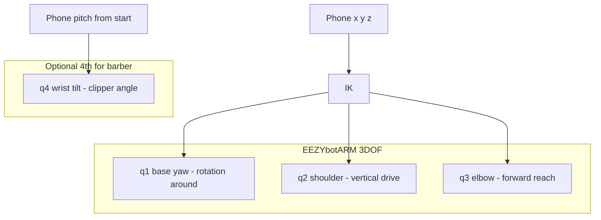
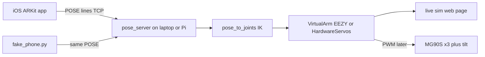

# Phone → EEZYbotARM Teleop (Step 1 TDD Plan)

Replace CV input with ARKit phone pose streaming into EEZYbotARM inverse kinematics, with a live sim demo and a minimal Xcode skeleton — built test-first with gated checkpoints before hardware.

---

## What the arm actually is

The physical target is **[EEZYbotARM (Thingiverse 1015238)](https://www.thingiverse.com/thing:1015238)** by daGHIZmo — not the fadegpt “arc rail around a head” design in `README.md` / `fadegpt/head.py`.



**Mental model for the demo** (around / height / tilt) maps like this:

| Intent | EEZYbotARM reality |
|--------|-------------------|
| Around | **q1** base servo (yaw) |
| Height + reach | **q2 + q3** coupled via parallelogram linkage (not independent “height only”) |
| Clipper tilt | **Not in stock 3DOF** — claw is open/close. Step 1 treats **phone pitch → q4** as a 4th channel in sim; hardware uses a tilt servo on the claw mount when wired, otherwise tilt is sim-only |

**Committed control mode:** absolute phone pose → IK (not rate JOG). Phone is a virtual hand holding the trimmer.

**Committed stack:** laptop/Pi runs IK at 50 Hz; minimal iOS app only streams ARKit pose; Pi can drive servos later via the same protocol.

---

## Architecture (step 1)



**Pose wire format** (new, line-based, same style as `fadegpt/protocol.py`):

```
START                          # zero pose origin
POSE <t_ms> <x_m> <y_m> <z_m> <qw> <qx> <qy> <qz>
STOP
STATUS
```

- `(x,y,z)` meters relative to `START` (ARKit world tracking).
- Quaternion = orientation relative to `START`.
- Camera frames are never sent.
- Downstream: scale meters → mm workspace, IK → `(q1,q2,q3)`, pitch → `q4`.
- Default pose port: **`8463`** (leave legacy `:8462` alone for now).

**Do not reuse** the old rail names `phi/psi/theta` for EEZY joints in new code — keep old teach/replay modules frozen or delete with CV; new names are `q1..q4`.

---

## Delete / keep

**Delete (CV path, unused for teleop):**

- `fadegpt/camera.py`, `fadegpt/vision.py`, `fadegpt/autopilot.py`
- `vision_demo.py`, `tests/test_vision.py`

**Keep for now (can prune later):** teach/replay/profile, `server.py` JOG/MOVE path — still useful as a joint-space fallback, but **not** the phone path.

**Replace conceptually:** rail `Head` FK with EEZYbotARM FK/IK module. Existing `firmware/robot_barber_arm` is stepper+rail — **out of scope for step 1 actuation**; step 1 hardware stub is PWM servos on Pi (new thin driver), sim first.

**IK reference (adapt, don’t vendor blindly):** [meisben/easyEEZYbotARM](https://github.com/meisben/easyEEZYbotARM) kinematics docs — implement our own pure functions under `fadegpt/eezy_ik.py` with fixed link lengths and unit tests (no runtime dependency on that repo).

---

## TDD phases (every gate has a failing test first)

### Phase 0 — Kill CV, green baseline

1. Delete CV files listed above.
2. **Checkpoint T0:** `uv run pytest` passes without vision tests.
3. Trim README vision subsection only after T0 green.

### Phase 1 — Pose protocol (no arm yet)

**New files:** `fadegpt/pose_protocol.py`, `tests/test_pose_protocol.py`

| ID | Test first | Pass when |
|----|------------|-----------|
| T1.1 | parse `POSE …` | 8 numbers + t_ms validated |
| T1.2 | reject bad lines | wrong arity / NaN → `ProtocolError` |
| T1.3 | `START` resets origin flag | subsequent poses accepted |
| T1.4 | quaternion normalized or rejected | \|q\| within 1e-3 of 1 |

**Checkpoint T1:** all protocol tests green. No network yet.

### Phase 2 — EEZYbotARM FK / IK (pure math)

**New files:** `fadegpt/eezy_ik.py`, `tests/test_eezy_ik.py`

Link lengths: constants matching EEZY MK1 (document measured mm once printed; start with published easyEEZYbotARM defaults).

| ID | Test first | Pass when |
|----|------------|-----------|
| T2.1 | FK known home | FK(q_home) ≈ expected XYZ within 1 mm |
| T2.2 | IK round-trip | for N reachable points, FK(IK(p)) ≈ p within 2 mm |
| T2.3 | unreachable | IK returns `None` / raises; never invents joints |
| T2.4 | joint limits | outputs always inside servo-safe ranges |
| T2.5 | tilt map | phone pitch deg → q4 linear map, clamped |

**Checkpoint T2:** IK suite green. This is the HARD GATE before phone or UI work.

### Phase 3 — Pose → joints mapper

**New files:** `fadegpt/pose_mapper.py`, `tests/test_pose_mapper.py`

| ID | Test first | Pass when |
|----|------------|-----------|
| T3.1 | origin | first pose after START → home joints |
| T3.2 | +Z phone | end effector Z increases (height) |
| T3.3 | lateral | base q1 rotates with correct sign |
| T3.4 | pitch | q4 follows pitch; q1–q3 unchanged for pure pitch |
| T3.5 | scale | 10 cm phone move → ~10 cm EEZY tip move (configurable scale, default 1.0) |
| T3.6 | out of reach | mapper holds last good joints + sets `reachable=false` (no jump) |
| T3.7 | slew limit | phone jumps don’t whip joint commands past max deg/s |

**Checkpoint T3:** mapper tests green. Fake phone can be written against this API.

### Phase 4 — Live pose server + fake phone (sim control loop)

**New/extend:** `pose_server.py` (or extend `server.py` with a `--pose` mode), `tools/fake_phone.py`, `tests/test_pose_server.py`

| ID | Test first | Pass when |
|----|------------|-----------|
| T4.1 | TCP accept | client connects; `START` → `OK` |
| T4.2 | stream | 50 synthetic `POSE` lines → joint state updates each tick |
| T4.3 | STATUS JSON | includes `q1..q4`, `x,y,z`, `reachable`, `mode` |
| T4.4 | bind | `--host 0.0.0.0 --port 8463` so phone on LAN can connect |

**Checkpoint T4 (manual + automated):**

```bash
uv run python pose_server.py --host 0.0.0.0 --port 8463
uv run python tools/fake_phone.py --circle 0.05   # 5 cm circle
# STATUS / logs show q1–q4 changing smoothly
```

### Phase 5 — Live sim visualization

**New:** `tools/eezy_sim.html` + small WS/SSE bridge from pose server (poll `STATUS` at 20 Hz is enough).

Show: base + two links + end effector (simple Three.js or 2D side+top views). Drive from server joints, **not** from phone directly.

| ID | Checkpoint | Pass when |
|----|------------|-----------|
| T5.1 | open page, run fake_phone circle | arm tip traces a visible circle |
| T5.2 | pitch-only script | only wrist indicator rotates |
| T5.3 | unreachable shove | arm freezes at workspace boundary; UI flags unreachable |

**Checkpoint T5:** demoable without a physical phone or arm.

### Phase 6 — Minimal Xcode ARKit skeleton

**New folder:** `ios/FadePose/` (SwiftUI + ARKit)

App does **only**:

1. ARWorldTrackingConfiguration (camera used internally; preview optional/minimal)
2. Button **Start** → send `START`, zero relative pose
3. Every frame (~60 Hz, throttle to 50 Hz): send `POSE t x y z qw qx qy qz`
4. Button **Stop**
5. Hardcoded host/port field (laptop IP)

**No** object detection, depth UI, maps, or robot logic on device.

| ID | Checkpoint | Pass when |
|----|------------|-----------|
| T6.1 | unit/host test with Network.framework mock | framing matches T1 |
| T6.2 | on device + pose_server | move phone 10 cm on table → STATUS Δ position ≈ 0.10 m ± 2 cm |
| T6.3 | tilt phone | q4 moves; position mostly stable if phone pivot is careful |
| T6.4 | sim UI | same live page as T5 tracks the real phone |

**Checkpoint T6:** end-to-end phone → IK → sim. Step 1 demo complete.

### Phase 7 — Pi servo path (stub, same protocol)

**New:** `fadegpt/eezy_servos.py` (pigpio or gpiozero PWM), `pose_server.py --hardware`

| ID | Checkpoint | Pass when |
|----|------------|-----------|
| T7.1 | dry-run | `--hardware --dry-run` prints pulse widths for q1–q4, no GPIO |
| T7.2 | single servo | base follows fake_phone yaw slowly, e-stop = process kill |
| T7.3 | optional | full 3DOF tracks a slow 3 cm triangle; clipper motor OFF |

**Checkpoint T7:** optional for step 1; do not block T6.

---

## Safety / product rules (encoded as tests where possible)

- Mannequin / air only — no human cutting in step 1.
- IK must refuse unreachable targets (T2.3, T3.6).
- Rate-limit joint commands (max deg/s) even when phone jumps (T3.7).
- Logs for teach/replay (if kept) still record **joint angles from the arm**, never raw phone pose — same philosophy as README §3.

---

## What step 1 explicitly is / is not

**Is:** CV removed; pose protocol; EEZY IK; fake phone; live sim; minimal ARKit Xcode app; optional Pi PWM stub.

**Is not:** full fade cutting physics on EEZY; rail/`phi` firmware; production BLE; vision critic; human cutting; calibrated hair-length control.

---

## Locked decisions

1. Physical target = **EEZYbotARM** (Thingiverse 1015238), not the repo’s arc-rail design.
2. **q4 wrist tilt** as a 4th sim channel (3DOF XYZ + tilt).
3. Pose TCP port **`8463`** separate from legacy `:8462`.
4. Implement **Phase 0→6** in order; Phase 7 optional.

---

## Implementation order

After approval, implement **one phase at a time**, tests first, stop at each checkpoint for a pass/fail check.
